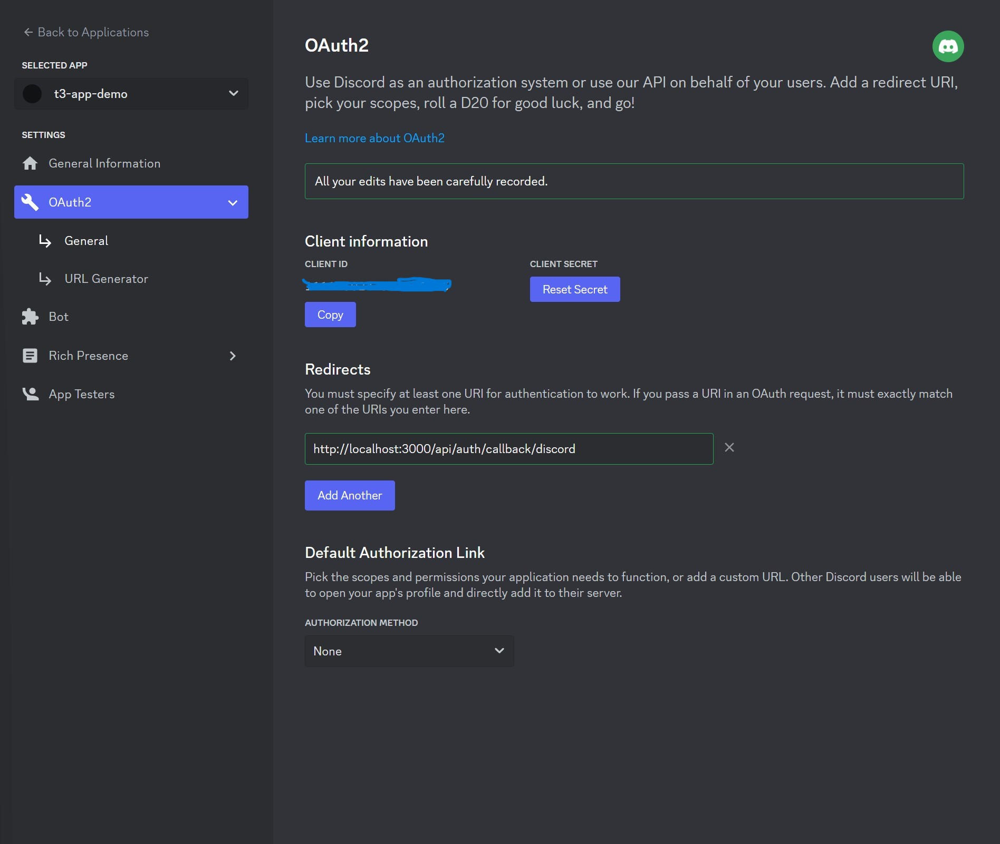
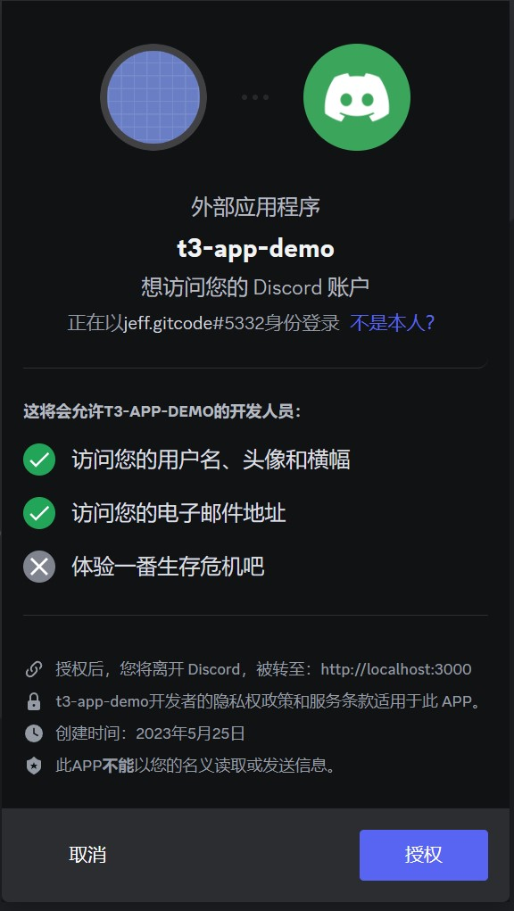
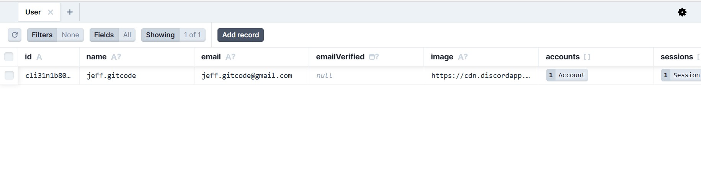

# Create T3 App Demo

# Tech Stack
- [x] Next.js
- [x] NextAuth.js
- [x] Prisma
- [x] Tailwind
- [x] tRPC
- [x] Discord
- [x] zod

```javascript
$ yarn create t3-app
or pnpm dlx create-t3-app@latest --CI --trpc --tailwind

$ yarn create v1.22.19
[1/4] Resolving packages...
[2/4] Fetching packages...
[3/4] Linking dependencies...
[4/4] Building fresh packages...
success Installed "create-t3-app@7.13.0" with binaries:
      - create-t3-app

   ___ ___ ___   __ _____ ___   _____ ____    __   ___ ___
  / __| _ \ __| /  \_   _| __| |_   _|__ /   /  \ | _ \ _ \
 | (__|   / _| / /\ \| | | _|    | |  |_ \  / /\ \|  _/  _/
  \___|_|_\___|_/‾‾\_\_| |___|   |_| |___/ /_/‾‾\_\_| |_|


? What will your project be called? t3-app-demo
? Will you be using TypeScript or JavaScript? TypeScript
Good choice! Using TypeScript!
? Which packages would you like to enable? nextAuth, prisma, tailwind, trpc
? Initialize a new git repository? Yes
Nice one! Initializing repository!
? Would you like us to run 'yarn'? Yes
Alright. We'll install the dependencies for you!
? What import alias would you like configured? ~/

Using: yarn

✔ t3-app-demo scaffolded successfully!

Adding boilerplate...
✔ Successfully setup boilerplate for nextAuth
✔ Successfully setup boilerplate for prisma
✔ Successfully setup boilerplate for tailwind
✔ Successfully setup boilerplate for trpc
✔ Successfully setup boilerplate for envVariables

$ cd t3-app-demo
$ yarn prisma db push
yarn run v1.22.19
Environment variables loaded from .env
Prisma schema loaded from prisma/schema.prisma
Datasource "db": SQLite database "db.sqlite" at "file:./db.sqlite"

SQLite database db.sqlite created at file:./db.sqlite

🚀  Your database is now in sync with your Prisma schema. Done in 87ms

$ yarn dev

# prisma studio
$ npx prisma studio
```

## Discord




## Prisma Studio




This is a [T3 Stack](https://create.t3.gg/) project bootstrapped with `create-t3-app`.


## What's next? How do I make an app with this?

We try to keep this project as simple as possible, so you can start with just the scaffolding we set up for you, and add additional things later when they become necessary.

If you are not familiar with the different technologies used in this project, please refer to the respective docs. If you still are in the wind, please join our [Discord](https://t3.gg/discord) and ask for help.

- [Next.js](https://nextjs.org)
- [NextAuth.js](https://next-auth.js.org)
- [Prisma](https://prisma.io)
- [Tailwind CSS](https://tailwindcss.com)
- [tRPC](https://trpc.io)

## Learn More

To learn more about the [T3 Stack](https://create.t3.gg/), take a look at the following resources:

- [Documentation](https://create.t3.gg/)
- [Learn the T3 Stack](https://create.t3.gg/en/faq#what-learning-resources-are-currently-available) — Check out these awesome tutorials

You can check out the [create-t3-app GitHub repository](https://github.com/t3-oss/create-t3-app) — your feedback and contributions are welcome!

## How do I deploy this?

Follow our deployment guides for [Vercel](https://create.t3.gg/en/deployment/vercel), [Netlify](https://create.t3.gg/en/deployment/netlify) and [Docker](https://create.t3.gg/en/deployment/docker) for more information.
